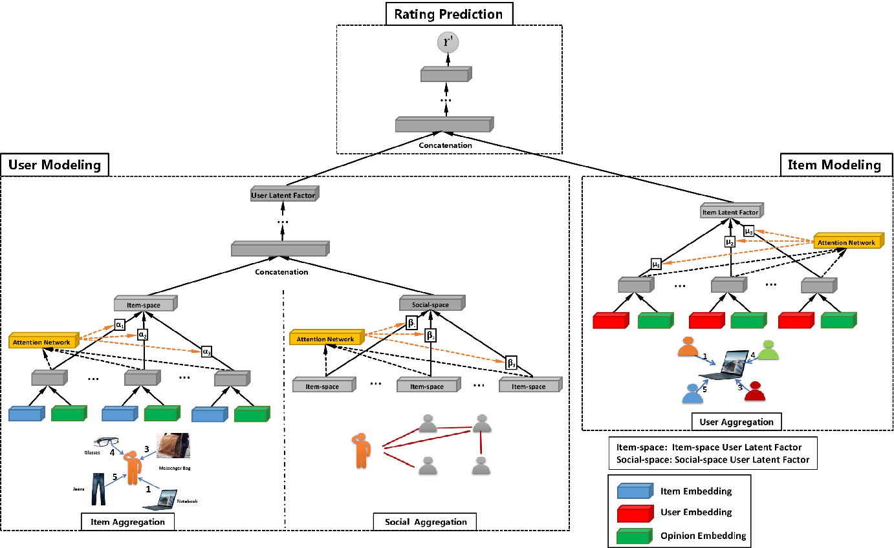
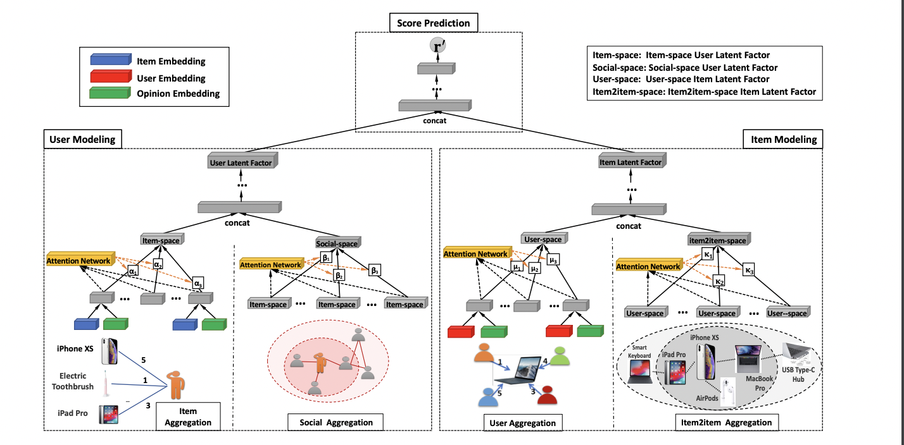
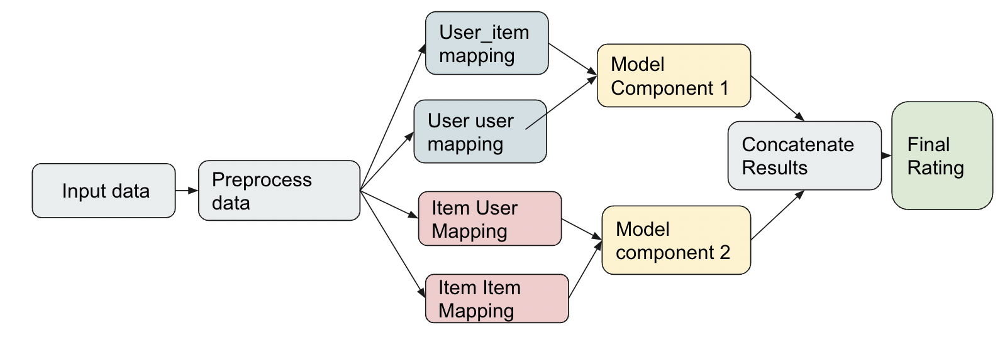

## MARS-GM: Multi Headed Recommendation System using Graphical Modeling
PyTorch implementation of the MARS-GM model which is meant to be a flexible framework for building, training and testing social recommendation models using Graph Modeling. The code has been developed using the GraphRec model codebase in [Graph Neural Networks for Social Recommendation](https://arxiv.org/pdf/1902.07243.pdf) (Fan, Wenqi, et al. "Graph Neural Networks for Social Recommendation." The World Wide Web Conference. ACM, 2019).

### The original graphrec architecture is as follows:


### The improved GraphRec+ Architecture
 

### Overview of data and model pipeline



# Usage

1. Install required packages from requirements.txt file.
```bash
pip install -r requirements.txt
```

2. Preprocess dataset. Two pkl files named dataset and list should be generated in the respective folders of the dataset.
```bash
python preprocess --dataset FilmTrust
```

3. Run main.py file to train the model. You can configure some training parameters through the command line. 
```bash
python main.py --epoch 30 --lr 10e-5
```

4. Run main.py file to test the model.
```bash
python main.py --test
```

